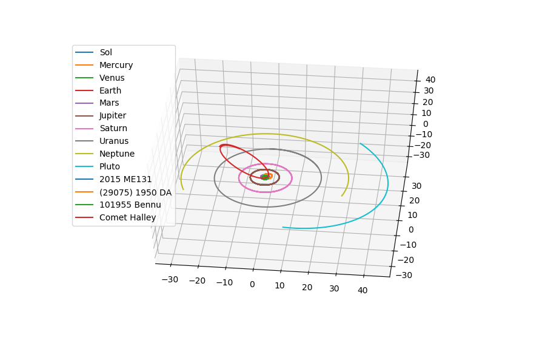

# Gravity Simulation in Haskell+TensorFlow

After playing around with [TensorFlow](http://tensorflow.org) for machine learning in a recent competition, I got curious about how well TensorFlow might work for other highly parallel problems. I also found out that TensorFlow has [Haskell bindings](https://github.com/tensorflow/haskell) (although they are not nearly as polished or complete as the Python bindings). To test out both of these, I decided to write a simple N-body gravity simulation in Haskell using TensorFlow. Given the initial positions, velocities and masses of several objects, it simulates their movements and interactions.

Using data from NASA on the current positions and velocities of various planets and other solar system bodies, I was able to simulate approximate for centuries into the future, and produce plots like the following:

